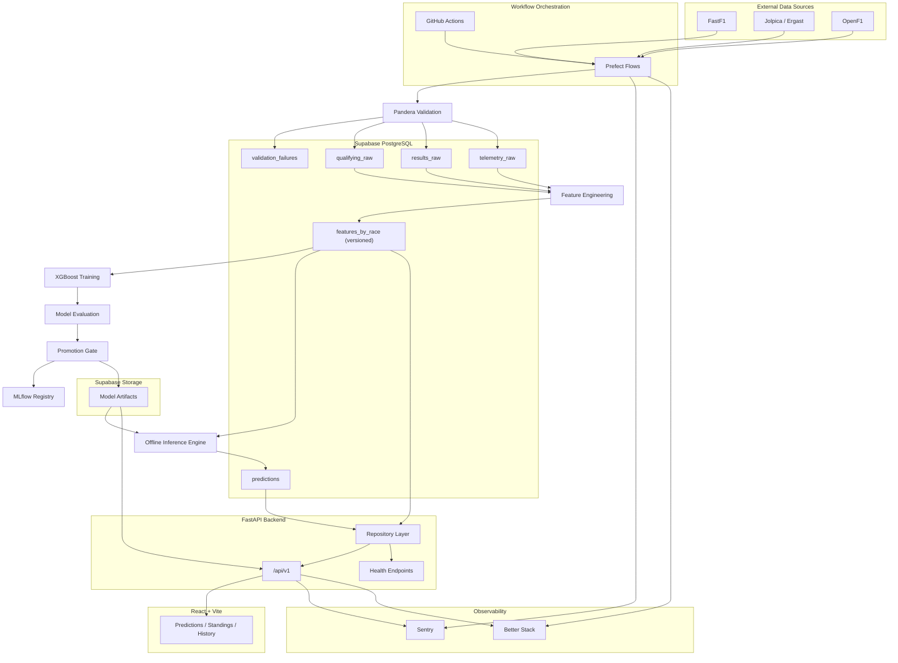

# F1 Prediction System

A production-grade Formula 1 race prediction engine that ingests qualifying and telemetry data from multiple APIs, engineers rolling features, trains XGBoost classifiers, and serves winner/podium probabilities through a versioned REST API — fully automated across an entire race season with no manual intervention.

---

## What Is This

An end-to-end ML system built around the F1 race calendar. After each qualifying session it automatically:

1. Fetches qualifying results and lap times from three external APIs
2. Validates every row against typed schemas, logging failures to an audit table
3. Computes 14 rolling driver, team, circuit, and session features per driver
4. Runs inference with a trained XGBoost model and writes ranked predictions to the database
5. Exposes those predictions through a FastAPI read layer within minutes of qualifying ending

Training runs automatically when enough new race results have accumulated. A promotion gate prevents any model that doesn't improve on at least 2 of 3 key metrics from reaching production.

---

## Architecture

## System Architecture



---
## How It Works

```
External APIs (FastF1 · Ergast/Jolpica · OpenF1)
        │
        ▼
  Prefect Flows  ──── GitHub Actions (schedule / trigger)
        │
  Pandera Validation  →  validation_failures audit table
        │
  qualifying_raw · results_raw · telemetry_raw   (Supabase / Postgres)
        │
  Feature Engineering  →  features_by_race  (versioned, v1/v2/...)
        │
  XGBoost Training  →  MLflow experiment registry
        │  (time-based split, auto-promotion gate)
  models/ (xgb_winner.json · xgb_podium.json · metadata.json)
        │  (persisted to Supabase Storage, survives Render redeploys)
        ▼
  FastAPI  ─── /api/v1/predictions · /standings · /races · /health
        │
  React / Vite Frontend  (Vercel)
```

**Pipeline triggers** are handled by GitHub Actions workflows on known race-weekend dates (post-qualifying Saturday, post-race Sunday). Flows are Prefect-decorated Python scripts run directly via `python -m workers.flows.<flow>`, so there is no dependency on Prefect Cloud.

**Feature versioning** — every row in `features_by_race` carries a `feature_version` column (`v1`, `v2`, …). Training and inference always read the same version. Adding or renaming a feature bumps the version; old rows remain queryable.

**Graceful degradation** — FastF1 and OpenF1 failures are non-fatal. If telemetry is unavailable, the pipeline continues with Ergast data only. If the model is missing at startup, the API refuses to start rather than serving stale or empty responses. The `/health/db` endpoint flags prediction staleness if the last stored prediction is older than 10 days during race season.

---

## Model Performance

Validated on the 2025 season (24 races), trained on 2018–2024 (2 976 rows):

| Metric | Value |
|---|---|
| Winner exact accuracy | **66.7 %** |
| Actual winner in top-3 predictions | **100 %** |
| Podium binary accuracy | **89.5 %** |

Feature importance leaders: `qualifying_position`, `podium_rate`, `avg_quali_last_5`, `constructor_form`.

---

## Tech Stack

| Layer | Technology |
|---|---|
| API | FastAPI · Uvicorn · slowapi (rate limiting) |
| ML | XGBoost · scikit-learn · MLflow · Pandas · Pandera |
| Data sources | FastF1 · Ergast/Jolpica · OpenF1 |
| Database | Supabase (Postgres) · SQLAlchemy · Alembic |
| Orchestration | Prefect (decorated flows) · GitHub Actions |
| Observability | Sentry · Better Stack · structured JSON logging |
| Deployment | Render (Docker, 2-stage build) · Vercel (frontend) |
| Frontend | React 19 · Vite · TanStack Query · Tailwind CSS |
| Testing | pytest · Pandera schema tests · FastAPI TestClient |

---

## Project Structure

```
backend/
├── app/
│   ├── api/v1/          # Thin route handlers (predictions, standings, health)
│   ├── core/            # Config, logging, Sentry init
│   ├── db/
│   │   ├── models/      # SQLAlchemy ORM models
│   │   └── repositories/# All DB reads/writes — one class per table group
│   ├── features/        # compute.py — 14 rolling feature functions
│   ├── integrations/    # ergast.py · fastf1_client.py · openf1.py
│   ├── ml/
│   │   ├── inference/   # InferenceEngine, artifact loader
│   │   ├── training/    # trainer.py, evaluator.py (promotion gate)
│   │   └── storage/     # Supabase Storage upload/download
│   ├── services/        # prediction_service.py (orchestrates inference)
│   └── validation/      # Pandera schemas for all 3 raw tables
├── workers/
│   ├── flows/           # post_qualifying · post_race · retrain · feature_engineering
│   └── tasks/           # fetch · validate · store · inference tasks
├── scripts/             # backfill.py — one-time historical ingest (2018–2024)
├── tests/unit/          # Feature, validation, repo, training, inference tests
├── alembic/             # Migration chain — all schema changes versioned
└── Dockerfile           # Two-stage build (builder + runtime, non-root user)

frontend/
├── src/
│   ├── api/client.ts    # Typed fetch layer — only place that knows the API URL
│   ├── hooks/           # useF1Data — TanStack Query wrappers
│   ├── components/      # PredictionCard, PodiumCard, standings cards
│   └── pages/           # Predictions · Standings · History
└── vercel.json          # SPA rewrite rule
```

---

## Running It Yourself

### Prerequisites

- Python 3.10+, Conda (env name `f1env`)
- Supabase project (Postgres + Storage bucket named `models`)
- `.env` file — copy `.env.example` and fill in values

```
DATABASE_URL=postgresql://...
SUPABASE_URL=https://[ref].supabase.co
SUPABASE_SERVICE_KEY=...
API_SECRET_KEY=...
SENTRY_DSN=          # optional
BETTERSTACK_TOKEN=   # optional
```

### Local API

```bash
conda activate f1env
pip install -r backend/requirements.txt

# Apply migrations
cd backend && alembic upgrade head

# Backfill historical data (2018–2024, ~60–90 min, Ergast rate-limited)
python -m scripts.backfill --from-year 2018 --to-year 2024

# Train initial model
python -m workers.flows.retrain_flow

# Start API
uvicorn main:app --reload --port 8000
```

### Local Frontend

```bash
cd frontend
npm install
# Set VITE_API_BASE_URL=http://localhost:8000 in frontend/.env
npm run dev
```

### Docker

```bash
docker build -f backend/Dockerfile -t f1-api ./backend
docker run -p 8000:8000 --env-file .env f1-api
```

### Run a flow manually

```bash
# Post-qualifying (ingest + features + inference)
python -m workers.flows.post_qualifying_flow 2025 10

# Sync standings
python -m scripts.cron_sync_standings
```

---

## API Endpoints

```
GET /api/v1/predictions                → latest race predictions (ranked)
GET /api/v1/predictions/{race_key}     → predictions for a specific race
GET /api/v1/predictions/races          → all race keys with stored predictions
GET /api/v1/standings/drivers?year=    → driver championship standings
GET /api/v1/standings/constructors?year=
GET /api/v1/races                      → all qualifying sessions in the database
GET /api/v1/health                     → process alive
GET /api/v1/health/db                  → DB reachable + prediction staleness check
GET /api/v1/health/model               → model loaded, version, feature count
```

All responses are JSON. Routes are read-only and public. Writes (retrain trigger, winner update) require a bearer token.

---

## CI/CD

GitHub Actions runs on every push to `main`:

```
lint → unit tests → integration tests → Docker build → Render deploy
```

Race-weekend triggers fire on known dates (post-qualifying Saturday, post-race Sunday). A weekly cron syncs standings every Monday 06:00 UTC. All jobs are idempotent — re-running never creates duplicates.

---

## Key Design Decisions

- **No inference at request time.** Predictions are computed offline and stored. The API is a database read bounded by Supabase query latency.
- **Feature versioning.** `feature_version` on every row. Mixing versions in one training run is a hard error.
- **Time-based train/val split only.** Random splits leak future race data into training.
- **Promotion gate.** A new model must beat production on ≥ 2 of 3 metrics by a minimum margin. Logging to MLflow regardless.
- **Idempotent writes everywhere.** All upserts use `ON CONFLICT DO UPDATE`. Re-running any flow is always safe.
- **Model artifacts in Supabase Storage.** Render free tier has no persistent disk. Artifacts survive redeploys via download-on-startup in the loader.